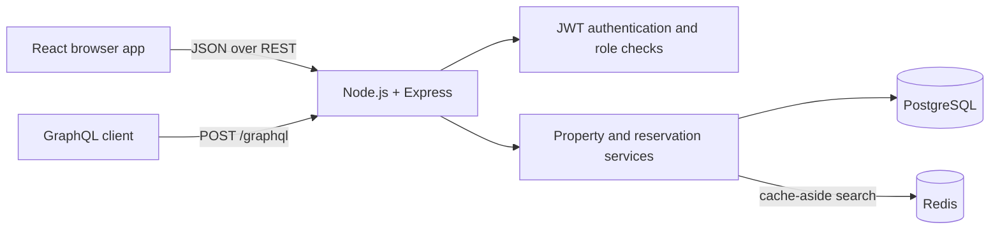
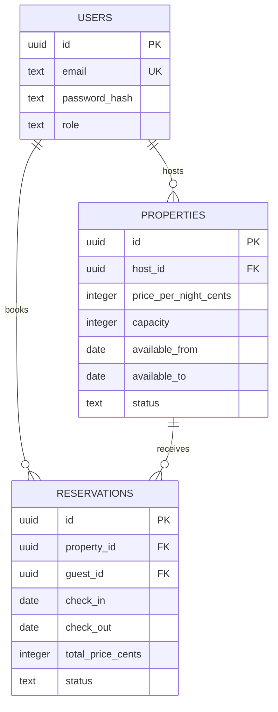

# StayFinder: end-to-end walkthrough

This document is the shortest complete explanation of how the project works and how to discuss it with a recruiter.

## 1. What the system does

There are two user roles:

- A **host** signs in and creates, views, updates, or deletes property listings.
- A **guest** searches published properties, filters by location, dates, and guest count, reserves available dates, sees their trips, and cancels a reservation.

The React app calls REST endpoints for its normal UI flows. A GraphQL endpoint exposes the same property search and reservation use cases for clients that want a query-based interface. Both transports call the same service functions, so business rules are not duplicated.

## 2. Architecture



The layers have deliberately small responsibilities:

| Layer | Responsibility |
| --- | --- |
| React components | Forms, navigation, loading/error feedback, host and guest views |
| REST routes / GraphQL resolvers | Convert HTTP or GraphQL input into a service call |
| Middleware and schemas | Verify JWTs, enforce roles, validate untrusted input |
| Services | Apply ownership, availability, pricing, caching, and reservation rules |
| PostgreSQL | Durable source of truth for users, properties, and reservations |
| Redis | Temporary copies of repeated property-search results |

This is not a microservice system. A modular monolith is easier to run, test, and explain, and it is appropriate for a prototype.

## 3. Data model



Important choices:

- Money is stored as integer cents, avoiding floating-point rounding errors.
- PostgreSQL constraints reject invalid roles, prices, capacities, statuses, and date ranges even if application validation is bypassed.
- A reservation stores its calculated total. A later property price change therefore does not rewrite historical booking totals.
- Dates use an end-exclusive interval: a reservation overlaps when `existing.check_in < requested.check_out` and `existing.check_out > requested.check_in`. A guest may check in on the same day another guest checks out.

## 4. End-to-end flows

### Login

1. React sends email and password to `POST /api/auth/login`.
2. The auth service loads the user from PostgreSQL and compares the password with the bcrypt hash.
3. The API returns an eight-hour signed JWT plus the safe user fields.
4. React stores that session in local storage and sends `Authorization: Bearer <token>` on protected requests.
5. Middleware re-verifies the JWT, reloads the user, and enforces either the `host` or `guest` role.

Registration is intentionally out of scope. Seeded accounts make a recruiter demo deterministic, while authentication and authorization are still real.

### Property search and Redis caching

1. `GET /api/properties` validates and normalizes `location`, `guests`, `checkIn`, and `checkOut`.
2. The property service reads the current cache version and hashes the normalized filters into a Redis key.
3. If the key exists, JSON is returned immediately with `X-Cache: HIT`.
4. On a miss, PostgreSQL searches published properties, checks capacity and listing dates, and excludes overlapping confirmed reservations.
5. The first 50 results are cached for 60 seconds and returned with `X-Cache: MISS`.
6. If Redis is unavailable, search falls back to PostgreSQL and reports `X-Cache: BYPASS`.

Every property create, update, or delete and every reservation create or cancel increments one Redis version key. Future searches automatically use a new namespace, so stale search entries are never read. This is O(1) invalidation and avoids scanning Redis for matching keys; old entries disappear through their TTL.

### Host property CRUD

1. The host opens the dashboard; React calls `GET /api/properties/mine`.
2. Create and update payloads are validated before SQL runs.
3. The service always derives `host_id` from the JWT, never from client input.
4. Updates and deletes include both property ID and host ID, so one host cannot change another host's listing.
5. A property with an active reservation cannot be deleted. Cancelled reservation rows are removed with the property in a transaction.
6. Successful writes invalidate cached searches.

### Guest reservation

1. React sends property ID, dates, and guest count to `POST /api/reservations`.
2. A PostgreSQL transaction takes a property-specific advisory lock. Two simultaneous requests for the same property are therefore checked one at a time.
3. The service verifies that the listing is published, the guest count fits, and the dates fall inside listing availability.
4. It rejects any overlap with a confirmed reservation.
5. It calculates `nights × price_per_night_cents`, inserts the confirmed reservation, commits, and invalidates search caches.
6. Cancellation changes status to `cancelled`; search invalidation makes those dates available again.

The lock is important: without it, two requests could both run the overlap query before either inserted a row, creating a double booking.

### GraphQL

`POST /graphql` supports:

```graphql
query Search {
  properties(location: "Aspen", guests: 2) {
    id
    title
    pricePerNight
  }
}
```

Authenticated guest queries and mutations include `myReservations`, `createReservation`, and `cancelReservation`. The resolvers call the same property and reservation services as REST. GraphQL is an additional interface, not a second implementation.

## 5. REST API

| Method | Route | Access | Purpose |
| --- | --- | --- | --- |
| `GET` | `/api/health` | Public | Verify PostgreSQL and Redis connections |
| `POST` | `/api/auth/login` | Public | Return JWT and user |
| `GET` | `/api/auth/me` | Signed in | Return current user |
| `GET` | `/api/properties` | Public | Search available published listings |
| `GET` | `/api/properties/:id` | Public | Get one listing |
| `GET` | `/api/properties/mine` | Host | List owned properties |
| `POST` | `/api/properties` | Host | Create a property |
| `PUT` | `/api/properties/:id` | Owning host | Replace property fields |
| `DELETE` | `/api/properties/:id` | Owning host | Delete if no active reservations |
| `GET` | `/api/reservations` | Guest | List the guest's trips |
| `POST` | `/api/reservations` | Guest | Create a conflict-checked reservation |
| `DELETE` | `/api/reservations/:id` | Owning guest | Cancel a reservation |
| `POST` | `/graphql` | Mixed | GraphQL query and mutation endpoint |

Errors have one predictable JSON shape: `{ "error": "message", "details": { ... } }`. Expected validation and business conflicts use 4xx status codes; unexpected failures use 500.

## 6. Testing and evidence

The verification is intentionally layered:

- **Backend integration tests:** run against live PostgreSQL and Redis. They cover health, both roles, JWT protection, cache MISS/HIT, invalidation, property create/update/delete, GraphQL search, reservation pricing, overlap rejection, trip retrieval, and cancellation.
- **React tests:** verify inventory rendering, cache feedback, demo login, session persistence, and role-based reservation controls.
- **Playwright tests:** exercise guest reserve/cancel and host create/edit/delete in Chromium through the real frontend and API.
- **Production build:** proves Vite can create deployable static assets.
- **Cache benchmark:** creates 25,000 temporary properties, measures 100 uncached PostgreSQL searches and 100 Redis hits, then deletes the fixture.

The verified local benchmark on July 11, 2026 measured:

| Path | Mean |
| --- | ---: |
| PostgreSQL search | 23.251 ms |
| Redis cache hit | 0.562 ms |
| Reduction | 97.6% |

Machine-local numbers will vary. This proves the caching mechanism and repeatable performance difference; it does **not** recreate the résumé's historical absolute values of 2 seconds and 400 milliseconds.

## 7. How this maps to the résumé

> Built end-to-end REST APIs using Node.js and Express for property CRUD and reservation flows, with a React-based user-facing frontend.

Directly backed by the REST routes, React host/guest workflows, backend integration tests, and Playwright journeys.

> Cut search response times from 2s to 400ms by implementing Redis caching for frequently accessed listings.

The repository backs the technical claim: cache-aside Redis search, `X-Cache: MISS/HIT/BYPASS`, invalidation on all availability-changing writes, and a repeatable benchmark. The exact `2s → 400ms` numbers are not reproduced by the current local environment. Use those absolute numbers only if they came from a real earlier measurement you can explain. Otherwise a defensible replacement is:

> Reduced repeated listing-search latency by 97% in a 25,000-property local benchmark by adding Redis cache-aside reads and version-based invalidation.

## 8. A two-minute recruiter explanation

“I started with the two core Airbnb roles: hosts manage inventory and guests search and reserve it. The frontend is React and talks to an Express API. PostgreSQL is the source of truth because properties and reservations have clear relationships and booking consistency matters.

The routes stay thin. Validation, authorization, pricing, availability, and caching live in reusable services, and both REST and GraphQL call those services. Search uses a cache-aside pattern in Redis. A repeated normalized query becomes a cache hit, while property or reservation changes increment a cache version so stale availability is never served.

The hardest correctness issue is double booking. Reservation creation runs in a PostgreSQL transaction with a lock scoped to the property, then checks date overlap and inserts the booking. That makes concurrent booking attempts serialize for one property.

I kept it as a modular monolith because it is a prototype: one deployable API, one database, and one cache are easier to reason about than premature microservices. I verified it at the service boundary with live PostgreSQL and Redis tests and at the user boundary with Chromium end-to-end tests.”

## 9. Tradeoffs and sensible next steps

- JWTs are simple and stateless, but production would use short-lived access tokens, refresh-token rotation, secure cookies, and secret management.
- Redis version invalidation is intentionally simple. At very high write volume, version churn and cache memory would need observation.
- Search returns at most 50 items. A real product would add cursor pagination, geospatial search, ranking, and stronger location indexes.
- Image URLs are external. Production would upload files to object storage and serve optimized variants through a CDN.
- The database migration runner is intentionally tiny. A larger team would adopt a dedicated migration tool and CI migration checks.
- The app has one API process. PostgreSQL and Redis make it possible to add stateless API replicas behind a load balancer later without changing the core design.

Those are conscious boundaries, not missing architecture required for this prototype.
