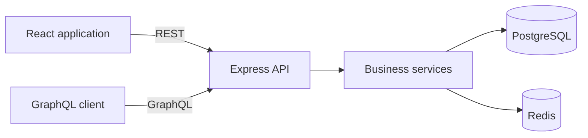

# StayFinder

A full-stack Airbnb-style application where hosts manage properties and guests search, reserve, and manage stays.


## Features

### Guests

- Search properties by location, dates, and guest count
- See live availability and nightly pricing
- Create reservations with conflict protection
- View upcoming and cancelled trips
- Cancel reservations and release availability

### Hosts

- Create, view, update, and delete properties
- Publish or save listings as drafts
- Manage pricing, capacity, bedrooms, images, and availability dates
- Access only properties owned by the authenticated host

### Platform

- JWT authentication with guest and host roles
- REST APIs for the complete React user experience
- GraphQL queries and reservation mutations
- PostgreSQL transactions that prevent double bookings
- Redis cache-aside search with automatic invalidation
- Input validation and consistent JSON errors
- Dockerized local environment with automatic migrations and seed data

## Technology

| Area | Technology |
| --- | --- |
| Frontend | React 19, Vite |
| Backend | Node.js, Express 5 |
| Database | PostgreSQL 16 |
| Cache | Redis 7 |
| APIs | REST, GraphQL |
| Authentication | JWT, bcrypt |
| Validation | Zod |
| Testing | Node test runner, Supertest, Vitest, Testing Library, Playwright |
| Runtime | Docker Compose, nginx |

## Architecture



REST routes and GraphQL resolvers share the same service layer. PostgreSQL is the source of truth, while Redis stores short-lived copies of repeated property searches. Property and reservation writes increment a cache version so stale availability is never returned.

## Run locally

### Prerequisite

- Docker Desktop

### Start the complete application

```bash
docker compose up --build
```

Open:

- Web application: [http://localhost:5174](http://localhost:5174)
- API: [http://localhost:3001](http://localhost:3001)
- Health check: [http://localhost:3001/api/health](http://localhost:3001/api/health)
- GraphQL endpoint: [http://localhost:3001/graphql](http://localhost:3001/graphql)

PostgreSQL migrations and seed data are applied automatically when the API starts.

### Demo accounts

Both accounts use the password `password123`.

| Role | Email |
| --- | --- |
| Guest | `guest@stayfinder.dev` |
| Host | `host@stayfinder.dev` |

### Stop the application

```bash
docker compose down
```

To also remove the local database volume:

```bash
docker compose down -v
```

## Local development

Node.js 22 or newer is required.

```bash
npm install
npm run setup
npm run dev
```

The development frontend runs on port `5174`; the API runs on port `3001`. PostgreSQL and Redis remain in Docker on ports `5433` and `6380`.

## Testing

Run the complete verification suite:

```bash
npm run verify:all
```

This runs:

- Backend integration tests against PostgreSQL and Redis
- React component and user-interaction tests
- A production frontend build
- Chromium end-to-end tests for guest and host workflows
- A Redis benchmark using a temporary 25,000-property dataset

Individual commands are also available:

```bash
npm test
npm run test:e2e
npm run benchmark
npm run build
```

## Repository structure

```text
backend/
  src/db/                 SQL migrations, seed data, PostgreSQL connection
  src/middleware/         Authentication and role authorization
  src/routes/             REST routes
  src/services/           Property, reservation, and authentication logic
  src/graphql.js          GraphQL schema and resolvers
  src/cache.js            Redis connection and cache invalidation
  test/                   API integration tests
frontend/
  src/components/         Search, booking, trip, and host interfaces
  src/App.jsx             Application state and workflow orchestration
  src/api.js              REST client
e2e/                      Playwright browser tests
docker-compose.yml        Complete local runtime
```
